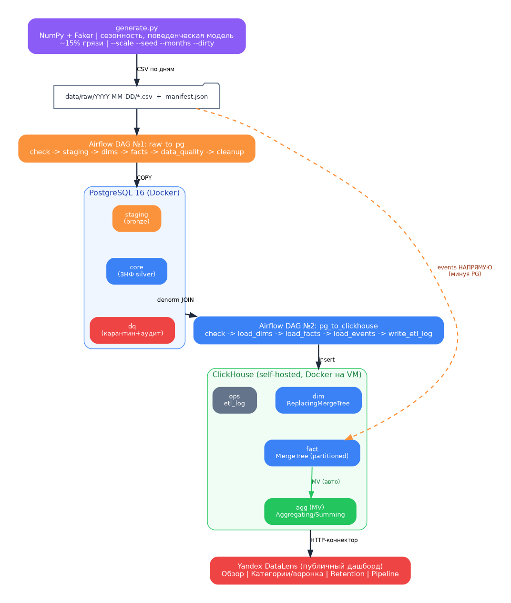
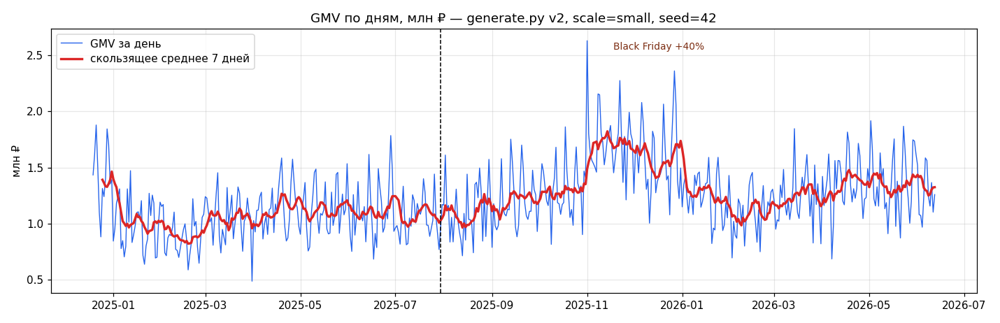
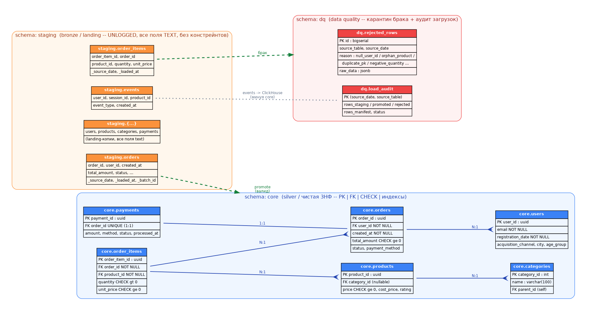
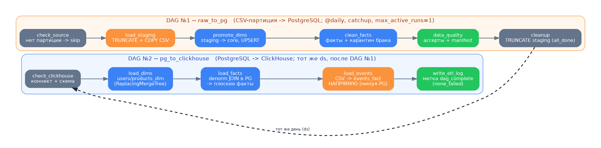
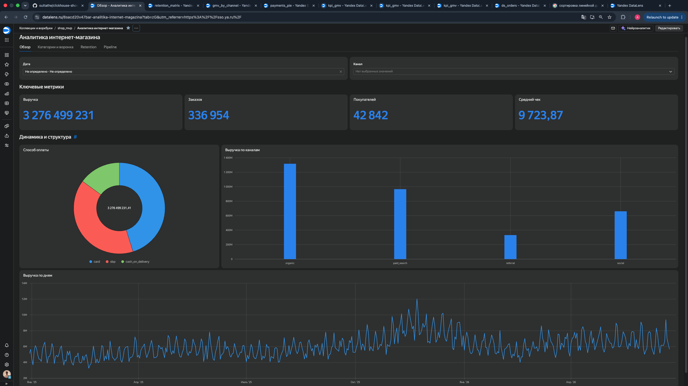
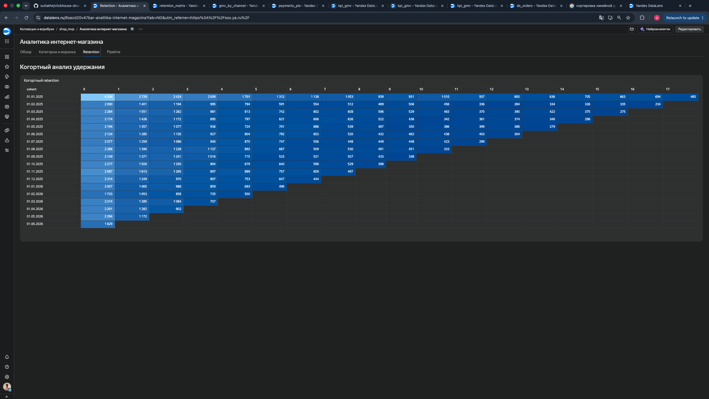
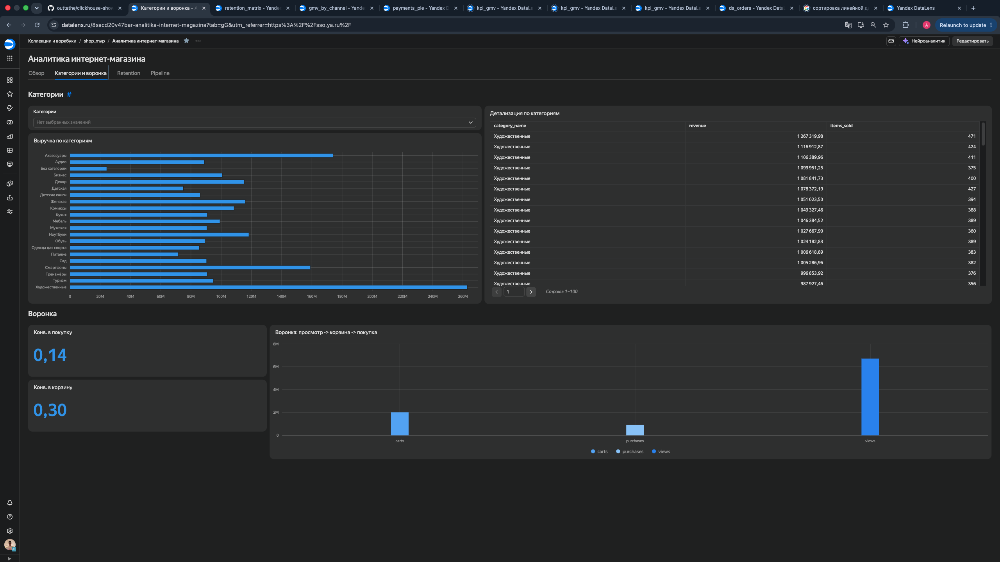
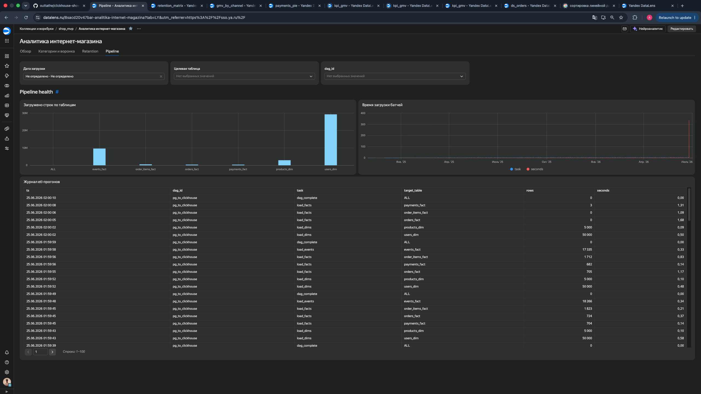

# ClickHouse Data Engineering Showcase

Сквозной демонстрационный data-пайплайн интернет-магазина: **генерация синтетических данных → PostgreSQL (слоистая 3НФ + карантин брака) → Apache Airflow → ClickHouse (денормализованные витрины + materialized views) → дашборд Yandex DataLens**.

Проект показывает полный цикл инженерии данных: моделирование схем (нормализованной и колоночной), оркестрацию инкрементальной загрузки, контроль качества данных, аналитику на специфичных функциях ClickHouse и BI-визуализацию.

> **Живой дашборд:** [[ссылка](https://datalens.yandex/8sacd20v47bar)]

> Учебный проект (НИТУ МИСИС, курс NoSQL) + портфолио Data Engineering.


---

## Содержание

- [Архитектура](#архитектура)
- [Что демонстрирует проект](#что-демонстрирует-проект)
- [Объём данных](#объём-данных)
- [Технологический стек](#технологический-стек)
- [Структура репозитория](#структура-репозитория)
- [Запуск с нуля](#запуск-с-нуля)
- [Слой генерации данных](#слой-генерации-данных)
- [Слой PostgreSQL](#слой-postgresql-staging--core--dq)
- [Оркестрация Airflow](#оркестрация-airflow)
- [Слой ClickHouse](#слой-clickhouse)
- [Аналитические запросы](#аналитические-запросы)
- [Дашборд DataLens](#дашборд-datalens)
- [Целевая архитектура масштабирования](#целевая-архитектура-масштабирования)
- [typeshit](#type-shit)

---

## Архитектура
<!-- 
```
                 ┌──────────────┐
                 │ generate.py  │  синтетика: сезонность, поведенческая
                 │ (NumPy/Faker)│  модель, ~15% «грязных» данных
                 └──────┬───────┘
                        │  CSV-партиции по дням
                        │  data/raw/YYYY-MM-DD/{orders,order_items,
                        │  payments,events,users,products}.csv + manifest.json
                        ▼
        ┌───────────────────────────────┐
        │   Airflow DAG №1: raw_to_pg    │   CSV → staging → core (3НФ)
        │   check → staging → dims →     │   брак → карантин dq.rejected_rows
        │   facts → data_quality → clean │   ассерты целостности core
        └───────────────┬───────────────┘
                        │
                        ▼
        ┌───────────────────────────────┐
        │      PostgreSQL (Docker)       │
        │  staging │ core (3НФ) │ dq     │   операционный слой
        └───────────────┬───────────────┘
                        │
        ┌───────────────────────────────┐
        │ Airflow DAG №2: pg_to_clickhouse│  core → денормализация (JOIN в PG)
        │ check → dims → facts →         │  → плоские факты в CH.
        │ events → write_etl_log         │  events: CSV → CH напрямую (минуя PG)
        └───────────────┬───────────────┘
                        │
                        ▼
        ┌───────────────────────────────┐
        │     ClickHouse (Docker, VM)    │   колоночное аналитическое хранилище
        │  dim │ fact │ agg (MV) │ ops   │   витрины наполняются materialized views
        └───────────────┬───────────────┘
                        │  HTTP-коннектор
                        ▼
                 ┌──────────────┐
                 │   DataLens   │   4 вкладки: Обзор · Категории/воронка
                 │  (публичный) │   · Retention · Pipeline (data quality)
                 └──────────────┘
``` -->

 

Ключевая идея — **разделение ответственности слоёв**: PostgreSQL держит нормализованную операционную модель с гарантиями целостности (PK/FK/CHECK) и карантином брака, а ClickHouse получает заранее денормализованные витрины, по которым аналитика идёт без единого JOIN.

---

## Что демонстрирует проект

| Компетенция | Где реализовано |
|---|---|
| Моделирование данных (3НФ + denorm) | `postgres/init.sql`, `clickhouse/schema.sql` |
| Слоистый ETL (bronze/silver + DQ) | staging → core → dq, карантин брака по причинам |
| Оркестрация и backfill | два Airflow-DAG'а, catchup по 18 месяцам истории |
| Контроль качества данных | `dq.rejected_rows`, `dq.load_audit`, ассерты целостности, сверка с manifest |
| Идемпотентность | UPSERT для dim'ов, DELETE-срез-перед-вставкой для фактов |
| Колоночная аналитика | партиционирование, `LowCardinality`, `ReplacingMergeTree` |
| Materialized views | 4 витрины: `AggregatingMergeTree` + `SummingMergeTree` с агрегатными состояниями |
| Специфичные функции CH | `windowFunnel`, `uniqExact`/`uniqHLL12`, `sumMerge`, retention-когорты |
| Управление ЖЦ данных | `TTL` на `events_fact` (24 месяца) |
| BI-визуализация | публичный дашборд DataLens на 4 вкладки |
| Воспроизводимость | `--seed`, Docker Compose, Makefile |

---

## Объём данных

Реальный прогон (`--scale medium`, 18 месяцев истории):

| Сущность | Строк | Слой |
|---|---:|---|
| `users_dim` | 100 000 | dim |
| `products_dim` | 5 000 | dim |
| `orders_fact` | 396 319 | fact |
| `order_items_fact` | 549 148 | fact |
| `payments_fact` | 384 286 | fact |
| `events_fact` | **9 616 729** | fact |
| `daily_gmv` (MV) | 540 | agg |
| `funnel_daily` (MV) | 540 | agg |
| `category_revenue_daily` (MV) | 11 324 | agg |

**Период:** 2024-12-30 … 2026-06-23. **Доступные масштабы:** `small` (~80k заказов), `medium` (~400k), `large` (~2M).

Данные не случайны: встроены месячная сезонность (Black Friday +40%, декабрь +25%, февраль −15%), недельный и суточный профили, линейный рост бизнеса и один **аномальный день с нулевыми продажами** (имитация инцидента) — он хорошо виден провалом на графике GMV.

---

## Технологический стек

| Компонент | Технология | Назначение |
|---|---|---|
| Генерация | Python 3.10+, NumPy, Pandas, Faker | Векторизованная синтетика |
| Операционная БД | PostgreSQL 16 (Docker) | Слоистая 3НФ + DQ-карантин |
| Оркестрация | Apache Airflow 2.10.5 (LocalExecutor) | Два ежедневных DAG'а |
| Аналитическая БД | ClickHouse (self-hosted, Docker на VM) | Колоночные витрины + MV |
| BI | Yandex DataLens | Публичный дашборд |
| Инфраструктура | Docker Compose, Yandex Cloud VM (Ubuntu) | Развёртывание |
| CH-драйвер | clickhouse-connect | Переливка PG → CH |

> ClickHouse развёрнут **self-hosted в Docker** на той же VM (HTTP-интерфейс :8123). Для продакшена легко заменяется на Managed ClickHouse в Yandex Cloud — меняются только параметры подключения в `.env`.

---

## Структура репозитория

```
clickhouse-showcase/
├── docker-compose.yml          # PostgreSQL + Airflow (CH разворачивается отдельно)
├── Makefile                    # gen / up / init / down / logs / psql
├── .env.example                # шаблон переменных окружения
│
├── generate/
│   └── generate.py             # генератор синтетики (CLI: scale/seed/months/dirty/partition)
│
├── postgres/
│   ├── init.sql                # DDL: схемы staging / core / dq
│   ├── initdb/                 # bootstrap метабазы Airflow
│   └── sql/                    # промоушен staging → core (standalone-версия)
│
├── airflow/
│   ├── Dockerfile
│   └── dags/
│       ├── raw_to_pg.py        # DAG №1: CSV → PostgreSQL
│       ├── pg_to_clickhouse.py # DAG №2: PostgreSQL → ClickHouse
│       └── sql/                # promote_dims, promote_facts, dq_assert
│
├── clickhouse/
│   └── schema.sql              # DDL: dim / fact / agg (MV) / ops
│
├── queries/
│   ├── Q1_gmv_daily.sql        # GMV/заказы/покупатели по дням
│   ├── Q2_top_categories.sql   # топ категорий по выручке
│   ├── Q3_cohort_retention.sql # когортный retention
│   ├── Q4_funnel.sql           # воронка через windowFunnel
│   ├── Q5_aov_discounts.sql    # AOV и влияние промокодов
│   └── signature/              # фирменные: market basket, approx-uniq
│
└── docs/
    └── REPORT.md               # пояснительная записка
```

---

## Запуск с нуля

**Требования:** Docker + Docker Compose, Python 3.10+.

### 1. Конфигурация

```bash
cp .env.example .env
# отредактировать пароли (PG_PASSWORD, AIRFLOW_ADMIN_PASSWORD, CH_*)
echo "AIRFLOW_UID=$(id -u)" >> .env
# сгенерировать Fernet-ключ для Airflow:
python -c "from cryptography.fernet import Fernet; print('AIRFLOW_FERNET_KEY='+Fernet.generate_key().decode())" >> .env
```

### 2. Генерация данных

```bash
python -m venv .venv && source .venv/bin/activate
pip install -r generate/requirements.txt

# суточные партиции под Airflow (medium, грязные данные, 18 мес):
python generate/generate.py --scale medium --months 18 --dirty --partition-by-day --output ./data/raw
```

На выходе — `data/raw/YYYY-MM-DD/*.csv` + `manifest.json` с эталонными счётчиками для DQ-проверок.

### 3. PostgreSQL + Airflow

```bash
docker compose up airflow-init     # один раз: миграции метабазы + admin
docker compose up -d               # поднять стек
# Airflow UI: http://localhost:8080
```

Схема PostgreSQL (`staging` / `core` / `dq`) накатывается автоматически из `postgres/init.sql` при первом старте.

### 4. ClickHouse

ClickHouse разворачивается отдельным Docker-контейнером на VM (HTTP :8123). Применить схему:

```bash
clickhouse-client --password "$CH_PASSWORD" --multiquery < clickhouse/schema.sql
```

### 5. Запуск пайплайна

В Airflow UI снять с паузы DAG'и **по порядку**:

1. `raw_to_pg` — прогонит catchup по всем дням: CSV → PostgreSQL.
2. `pg_to_clickhouse` — после первого: PostgreSQL → ClickHouse.

### 6. Дашборд

Подключить DataLens к ClickHouse (тип «ClickHouse», host = IP VM, порт 8123), собрать датасеты на витринах и опубликовать.

---

## Слой генерации данных

`generate/generate.py` — векторизованный (NumPy) генератор, не наивные циклы. Поэтому `large` (2M заказов, десятки млн событий) генерируется за разумное время.

**CLI:**

```bash
python generate/generate.py \
    --scale {small|medium|large} \   # объём
    --seed 42 \                      # воспроизводимость
    --months 18 \                    # глубина истории
    --dirty \                        # включить «грязь»
    --partition-by-day \             # партиции под Airflow (иначе монолитные CSV)
    --output ./data/raw
```

**Поведенческая модель (Монте-Карло «снизу»).** У каждого пользователя два персистентных свойства, разыгранных один раз:

- `propensity` (гамма-распределение) — базовая склонность к покупке. Появляются «киты» и одноразовые покупатели; число заказов на пользователя получает реалистичный тяжёлый правый хвост.
- `tau` — время затухания активности после регистрации: ~25% пользователей «лояльные» (`tau=400` дней, почти не остывают), остальные — `tau=60`. Вместе это даёт честные retention-кривые: пик в M+0, спад к M+1/M+2, длинный хвост.

**Причинная воронка событий.** События не разбросаны случайно: для каждой покупки строится цепочка `view → cart → purchase` с общим `session_id`, плюс «холостые» просмотры и брошенные корзины — так, чтобы конверсии стремились к целевым (view→cart ≈ 30%, cart→purchase ≈ 45%). Это позволяет считать воронку и через `windowFunnel`.

**Режим `--dirty`.** Контролируемая доля брака для демонстрации DQ-слоя: дубликаты `order_id` (ретраи источника), `NULL` в ключах, отрицательные количества, товары-сироты (несуществующий `product_id`), товары без категории, дубликаты событий. Каждый тип потом отлавливается и карантинится на промоушене в `core`.



---

## Слой PostgreSQL (staging → core → dq)

Три схемы с чётким разделением ответственности:

### `staging` — landing (bronze)

`UNLOGGED`-таблицы, все поля `TEXT`, без констрейнтов. Принимают данные генератора **как есть** — никогда не отклоняют строку. Метаколонки `_source_date` / `_loaded_at` / `_batch_id` дают трассировку партиции. `TRUNCATE` перед загрузкой и после (транзиентный слой).

### `core` — чистая 3НФ (silver)

`categories`, `users`, `products`, `orders`, `order_items`, `payments` с полным набором гарантий: PK (UUID/SERIAL), FK `ON DELETE RESTRICT`, CHECK-констрейнты, индексы по FK и датам.

**Констрейнты подобраны так, чтобы именно грязь генератора отсеивалась при промоушене:**

| Тип брака | Механизм отсева |
|---|---|
| `NULL user_id` в заказах | `NOT NULL` → hard reject |
| `NULL`/orphan `product_id` в позициях | `NOT NULL` + FK → hard reject |
| `quantity < 0` | `CHECK (quantity > 0)` → hard reject |
| дубликат `order_id` | `PRIMARY KEY` → hard reject |
| товар без категории | `category_id` nullable → **soft flag** (не reject) |

> **Высокообъёмные `events` сознательно не нормализуются в `core`** — загонять десятки млн append-only фактов в констрейнтную 3НФ нереалистично. Они идут из CSV прямо в ClickHouse.

### `dq` — data quality

- `dq.rejected_rows` — карантин: каждая отклонённая строка с причиной (`null_user_id` / `orphan_product` / `duplicate_pk` / …) и полным исходным payload в `JSONB` для разбора.
- `dq.load_audit` — паспорт каждого прогона: сколько строк пришло в staging, доехало в core, ушло в карантин, ожидалось по manifest. Один `SELECT` показывает здоровье пайплайна — источник для вкладки Pipeline в дашборде.

 

---

## Оркестрация Airflow

Два ежедневных DAG'а, `catchup=True` + `max_active_runs=1` (строго последовательный backfill по дням).

### DAG №1 — `raw_to_pg`

```
check_source → load_staging → promote_dims → clean_facts → data_quality → cleanup
```

CSV-партиция за `ds` → `staging` → `core`, с карантином брака. Линейный поток.

- `check_source` — нет партиции за день (пустой/аномальный день) → `skip`.
- `load_staging` — `TRUNCATE` staging → `COPY` партиции → проставить `_source_date`.
- `promote_dims` — справочники → `core` через **UPSERT** (повторный прогон не ломается, dim'ы накапливаются инкрементально).
- `clean_facts` — факты → `core` с маршрутизацией брака в `dq.rejected_rows` (карантин дня очищается перед прогоном — идемпотентность).
- `data_quality` — пишет паспорт в `dq.load_audit` + **жёсткие ассерты**: целостность `core` (orphan/CHECK/NULL должны быть 0) и сверка с `manifest.json` (потеря данных → падение DAG).
- `cleanup` — `TRUNCATE` staging (`trigger_rule=all_done` — чистим независимо от исхода).

### DAG №2 — `pg_to_clickhouse`

```
check_clickhouse → load_dims → load_facts → load_events → write_etl_log
```

Переливка `core` → ClickHouse с денормализацией.

- `check_clickhouse` — проверка коннекта и наличия схемы.
- `load_dims` — `users_dim` + `products_dim` (денормализуется `category_name` из `categories`) → `ReplacingMergeTree`.
- `load_facts` — денормализующие JOIN-запросы в PG дают плоский результат, который вставляется в CH как есть. Идемпотентность: `DELETE ... WHERE toDate(...) = ds` перед вставкой среза дня.
- `load_events` — события за день из **CSV напрямую** в `events_fact`, минуя PostgreSQL (читаются чанками по 500k). Нет файла за день → `skip`.
- `write_etl_log` — финальная метка `dag_complete` в `etl_log`. `trigger_rule=none_failed` — метка пишется даже когда `load_events` штатно скипнулся в пустой день (иначе журнал терял бы эти дни).



---

## Слой ClickHouse

Четыре уровня объектов:

### `dim` — справочники (`ReplacingMergeTree`)

`users_dim`, `products_dim` — дедупликация по ключу, версия `updated_at`. В `products_dim` категория денормализована (`category_name`).

### `fact` — факты (`MergeTree`, помесячное партиционирование)

Атрибуты справочников «вшиты» в факты → аналитика без JOIN:

- `orders_fact` — заказы + атрибуты пользователя (`acquisition_channel`, `user_city`, `user_age_group`) + `items_count`.
- `order_items_fact` — позиции + товар + категория (`line_revenue`).
- `events_fact` — поведенческие события, **`TTL 24 месяца`** (управление жизненным циклом).
- `payments_fact` — платежи.

Везде `LowCardinality(String)` для перечислимых полей, `PARTITION BY toYYYYMM(...)`, осмысленный `ORDER BY`.

### `agg` — витрины через Materialized Views

Наполняются **автоматически на вставку** в факты — отдельного ETL для них нет:

| Витрина | Движок | Что считает |
|---|---|---|
| `daily_gmv` | `AggregatingMergeTree` | GMV / заказы / уникальные покупатели по дням (агрегатные состояния `sumState`/`uniqState`) |
| `category_revenue_daily` | `SummingMergeTree` | выручка / штуки по категории и дню |
| `funnel_daily` | `SummingMergeTree` | счётчики `view`/`cart`/`purchase` по дням |
| `user_category_first_buy` | `AggregatingMergeTree` | первая покупка пользователя в категории |

### `ops` — мониторинг

`etl_log` — журнал переливки (таблица, строк, время, статус по каждому таску) — источник для вкладки Pipeline.

---

## Аналитические запросы

В `queries/` — 5 базовых + 2 фирменных. Каждый использует сильные стороны ClickHouse и читает из подходящего движка.

| № | Запрос | Бизнес-вопрос | Ключевые приёмы CH |
|---|---|---|---|
| Q1 | GMV по дням | Динамика выручки, где аномалии? | `sumMerge`/`uniqMerge` поверх `AggregatingMergeTree` |
| Q2 | Топ категорий | Кто приносит больше денег? | финальная агрегация над `SummingMergeTree` |
| Q3 | Когортный retention | % вернувшихся в M+1/M+2 | `toStartOfMonth`, `dateDiff`, `uniqExact` |
| Q4 | Воронка | Конверсия view→cart→purchase | **`windowFunnel(86400)`** по сессиям |
| Q5 | AOV и скидки | Влияние промокодов на чек | сегментация, `avg`/`sum` |
| S2 | Market basket | Какие категории берут вместе | self-join по `order_id` (e-commerce-аналог графовой аналитики) |
| S3 | Approx-uniq | Точные vs приближённые уникальные | `uniqExact` vs `uniqCombined` vs **`uniqHLL12`** |

Запросы над витринами (Q1, Q2) в разы дешевле, чем те же агрегаты по сырым фактам — в этом и смысл предрасчёта через MV.

---

## Дашборд DataLens

Публичный дашборд на **4 вкладки**, коннектор к ClickHouse по HTTP:

| Вкладка | Содержание |
|---|---|
| **Обзор** | KPI (GMV, заказы, AOV, конверсия), GMV по дням, разрез по способам оплаты |
| **Категории и воронка** | топ категорий по выручке, воронка view→cart→purchase |
| **Retention** | когортная матрица удержания (по дате первой покупки) |
| **Pipeline** | health пайплайна из `etl_log`: объёмы загрузок, статусы, тайминги |

**Публичная ссылка:** [[ссылка](https://datalens.yandex/8sacd20v47bar)]

 
 
 
 

---

## Целевая архитектура масштабирования

При переходе на промышленную нагрузку:

- **Репликация и шардирование.** `MergeTree` → `ReplicatedMergeTree` (хранение метаданных реплик в ClickHouse Keeper / ZooKeeper), поверх шардов — `Distributed`-таблицы. Это даёт отказоустойчивость и горизонтальное масштабирование чтения/записи.
- **Оркестрация.** Замена ручного снятия DAG'ов с паузы на data-aware scheduling (Airflow Datasets): `pg_to_clickhouse` триггерится автоматически по готовности данных `raw_to_pg`.
- **CDC вместо батч-переливки.** Для near-real-time — Debezium на WAL PostgreSQL → Kafka → ClickHouse (движок `Kafka` / `ClickPipes`), что убирает суточную задержку.

---

## Лицензия и контекст

Учебно-демонстрационный проект. Данные полностью синтетические, не содержат реальной информации.

# type shit

<p align="center">
  
</p>
