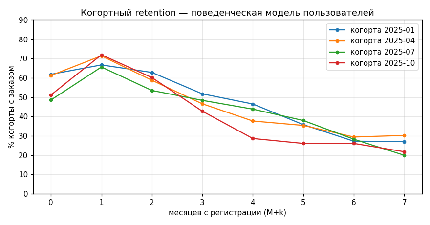

# ClickHouse Data Engineering Showcase — пояснительная записка

> Версия: v2 (в работе) · Дата: 07.06.2026 · Автор: Шубкин Александр Андреевич

---

## 1. Тема проекта

Сквозной демонстрационный data-пайплайн интернет-магазина:
**генерация синтетических данных → PostgreSQL (3НФ, операционный слой) → ClickHouse (денормализованный аналитический слой) → дашборд Yandex DataLens**, с оркестрацией загрузки через Apache Airflow и мониторингом пайплайна в Grafana (фаза v2).

Предметная область — маркетплейс: пользователи, товары, заказы, позиции заказов, платежи и поведенческие события (просмотр → корзина → покупка). Легенда выбрана за универсальную понятность: сущности «пользователь / товар / заказ» не требуют объяснений слушателю без технического бэкграунда.

## 2. Цель и задачи

**Цель** — продемонстрировать и закрепить компетенции в области Data Engineering и администрирования аналитической инфраструктуры: проектирование схем хранения (нормализованной и денормализованной), построение ETL/ELT-процессов, развёртывание и сопровождение ClickHouse-кластера в Яндекс Облаке, оркестрация и контроль качества данных.

**Задачи:**

1. Реализовать воспроизводимый генератор реалистичных синтетических данных с управляемыми статистическими свойствами (сезонность, поведенческая модель пользователя, контролируемая доля «грязных» записей).
2. Спроектировать схему PostgreSQL в 3НФ и процесс инкрементальной загрузки сырых данных с карантином брака.
3. Развернуть собственный кластер ClickHouse в Яндекс Облаке и реализовать ETL-переливку PostgreSQL → ClickHouse в денормализованные витрины.
4. Оркестровать пайплайн в Apache Airflow (ежедневные DAG'и, backfill исторических данных, data quality проверки).
5. Реализовать набор аналитических SQL-запросов, использующих специфичные возможности ClickHouse (`windowFunnel`, `retention`, approx-агрегаты).
6. Построить публичный аналитический дашборд в DataLens и operations-дашборд пайплайна в Grafana.

## 3. Основная часть

### 3.1 Архитектура решения (целевая, v2)

```
generate.py ──CSV по дням──▶ Airflow DAG №1 ──▶ PostgreSQL (3НФ + карантин)
                                                    │
                                              Airflow DAG №2
                                                    ▼
                                       ClickHouse (Яндекс Облако)
                                        факты + витрины + MV
                                          │               │
                                          ▼               ▼
                                      DataLens         Grafana
                                   (бизнес-аналитика) (мониторинг ETL)
```

Разделы 3.2+ (PostgreSQL, Airflow, ClickHouse, дашборды) дополняются по мере реализации соответствующих этапов.

---

## 4. Исходные данные. Генератор данных

Источником данных служит собственный генератор [`generate/generate.py`](../generate/generate.py) — Python-скрипт (~620 строк, numpy + pandas + Faker), создающий согласованный набор из семи сущностей: `categories`, `users`, `products`, `orders`, `order_items`, `payments`, `events`.

### 4.1 Интерфейс и режимы запуска

```bash
# монолитные CSV (совместимо с load.py из МВП)
python generate.py --scale small --seed 42 --output ./data

# партиции по дням + «грязные» данные — режим для Airflow
python generate.py --scale medium --dirty --partition-by-day --output ./data/raw
```

Масштабы заданы таблицей [`SCALES`](../generate/generate.py#L50):

| scale | users | products | orders | events (факт.) |
|---|---|---|---|---|
| small | 10 000 | 1 000 | 80 000 | ~1.9 млн |
| medium | 50 000 | 5 000 | 400 000 | ~9.5 млн |
| large | 200 000 | 10 000 | 2 000 000 | ~48 млн |

Воспроизводимость: все источники случайности подчинены одному сиду (`--seed`); два запуска с одинаковыми параметрами дают **побайтово идентичные файлы** (проверено сравнением md5).

### 4.2 Статистическая модель данных (метод Монте-Карло)

Генератор построен по гибридной схеме Монте-Карло: целевые объёмы фиксируются «сверху», а структура данных разыгрывается «снизу» из вероятностных распределений.

**Спрос и сезонность.** Суммарное число заказов раскладывается по дням мультиномиальным распределением, где вес дня ([`day_weights`](../generate/generate.py#L139)) — произведение четырёх факторов: месячной сезонности ([`MONTH_MULT`](../generate/generate.py#L57): ноябрь ×1.40 — Black Friday, декабрь ×1.25, февраль ×0.85), недельной ([`DOW_MULT`](../generate/generate.py#L61): пик в субботу), линейного роста бизнеса +35% за период ([`GROWTH_END`](../generate/generate.py#L71)) и нормального шума ±7%. Внутри дня метки времени следуют суточному профилю ([`HOUR_W`](../generate/generate.py#L64)) с вечерним пиком 19–22 ч. Один будний день в средней трети периода получает вес 0 — **аномальный день** с полным отвалом продаж (имитация инцидента; при `seed=42` это 2025‑07‑30).


**Поведенческая модель пользователя.** Покупатель дня выбирается не равномерно, а пропорционально индивидуальному весу ([строка 256](../generate/generate.py#L256)):

```
w(user, t) = propensity × ( e^(−age/τ) + 0.03 )
```

где `propensity ~ Gamma(1.2, 1.0)` — постоянная склонность к покупке ([строка 566](../generate/generate.py#L566)), `age` — дней с момента регистрации, а τ задаёт остывание интереса: у ~25% «лояльных» пользователей τ = 400 дней, у остальных τ = 60; слагаемое 0.03 — фоновая вероятность вернуться. Эта модель даёт два свойства, отличающих данные от «равномерной» синтетики:

- тяжёлый правый хвост числа заказов на покупателя (медиана 5, p99 = 63, максимум 204 — есть «киты»);
- реалистичные retention-кривые: спад от ~70% в M+1 до ~27% в M+6 с плато лояльного ядра — когортная матрица на дашборде выглядит как у живого продукта.



**Цены и популярность товаров.** Цены — логнормальное распределение `LogN(7.3, 0.8)` (медиана ≈ 1500 ₽, [`gen_products`](../generate/generate.py#L209)); себестоимость 40–70% цены. Популярность товаров — распределение Парето (α = 1.5): небольшая доля товаров-«хитов» собирает значимую долю продаж.

**Согласованность сущностей.** Сумма заказа вычисляется из его позиций (`total = Σ qty×price − discount`); промокод есть у ~15% заказов ([`PROMO_SHARE`](../generate/generate.py#L86)) со скидкой 5–20%. Платёж ([строка 303](../generate/generate.py#L303)) связан с заказом 1:1 и статусно согласован: `completed → succeeded`, `returned → refunded`, `cancelled → failed` либо без платежа (30%). Проверка на сгенерированных данных: тождество суммы выполняется в 100% строк.

**Воронка событий.** События строятся причинно, от покупки вверх ([строки 322–360](../generate/generate.py#L322)): на каждую позицию неотменённого заказа создаётся `purchase`-событие (общий `session_id` на заказ), к ним достраиваются брошенные корзины до целевой конверсии cart→purchase = 45% ([строка 336](../generate/generate.py#L336)) и «холостые» просмотры до view→cart = 30% ([строка 350](../generate/generate.py#L350)). Временные метки упорядочены: view → cart (через 1–30 мин) → purchase (через 2–60 мин). Фактические конверсии в сгенерированных данных совпадают с целевыми с точностью до 0.1 п.п., что делает осмысленным расчёт воронки в ClickHouse через `windowFunnel()` по `session_id`.

### 4.3 «Грязные» данные

Флаг `--dirty` включает контролируемую порчу данных ([`DirtConfig`](../generate/generate.py#L100), [`apply_dirt_day`](../generate/generate.py#L395)) — имитацию дефектов реальных источников, которые обязан перехватывать ETL-слой:

| Дефект | Доля | Легенда |
|---|---|---|
| Дубликаты заказов (тот же `order_id`, время +1–30 мин) | 2% | Ретрай интеграции / двойной клик |
| `NULL user_id` в заказах | 1% | Гостевой заказ, потерянный идентификатор |
| `NULL product_id` в позициях | 1% | Брак выгрузки источника |
| Отрицательное `quantity` | 1% | Возвраты, записанные в ту же таблицу |
| `product_id`-сирота (нет в справочнике) | 1% | Рассинхронизация справочника |
| Товары без категории | 2% | Незаполненная карточка |
| Дубликаты событий | 0.5% | Повторная доставка из очереди |

Все объёмы внесённой грязи печатаются в итоговой сводке запуска — это эталон для проверки полноты карантина на этапе DQ.

### 4.4 Партиционирование под Airflow

Режим `--partition-by-day` ([`Writer`](../generate/generate.py#L452)) раскладывает данные в структуру «один день — одна партиция»:

```
data/raw/
├── categories.csv                  # справочник целиком
├── 2025-07-29/
│   ├── users.csv                   # пользователи, зарегистрированные в этот день
│   ├── products.csv                # товары, добавленные в этот день
│   ├── orders.csv / order_items.csv / payments.csv / events.csv
│   └── manifest.json               # контрольные счётчики строк по каждому файлу
└── 2025-07-31/ ...                 # 2025-07-30 отсутствует — аномальный день
```

Справочники нарезаются по дате появления записи (день регистрации пользователя / добавления товара), то есть растут инкрементально — это создаёт естественный поток обновлений для `ReplacingMergeTree` в ClickHouse. [`manifest.json`](../generate/generate.py#L476) фиксирует ожидаемое число строк по каждой сущности дня и служит контрольной суммой для data quality шага DAG'а: расхождение «загружено в PG» против манифеста — сигнал потери данных.

### 4.5 Производительность и итоги тестовых прогонов

| Метрика | Значение |
|---|---|
| Время генерации, scale=small | ~23 с (лимит ТЗ — 120 с) |
| Сезонность (заказов в месяц) | ~4 000 базово → 6 193 в ноябре → 3 070 в феврале |
| Аномальный день | 0 заказов и 0 событий |
| Воронка view→cart→purchase | 30.0% / 45.0% (= целевым) |
| Медиана цены товара | 1 490 ₽ (цель ~1 500 ₽) |
| Тождество `total = Σ items − discount` | 100% заказов |
| Воспроизводимость по seed | md5 файлов идентичны между запусками |

Ключевое решение по производительности: генерация фактов полностью векторизована (numpy) и идёт дневными батчами; Faker используется только для пулов имён/городов справочников. Это даёт линейное масштабирование: large (~2 млн заказов, ~48 млн событий) генерируется за ~10–15 минут при постоянном потреблении памяти (события пишутся на диск по дням, а не копятся в RAM).

---

## 5. Слой PostgreSQL *(заполняется на этапе 2)*

## 6. Оркестрация Apache Airflow *(заполняется на этапе 2–3)*

## 7. Слой ClickHouse *(заполняется на этапе 3–4)*

## 8. Дашборды: DataLens и Grafana *(заполняется на этапе 5–6)*

## 9. Выводы *(заполняется по завершении)*
